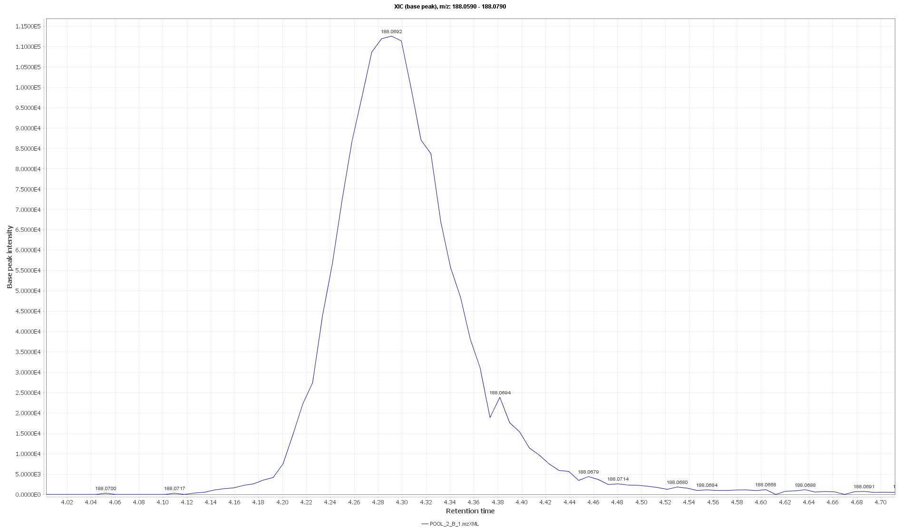

XCMS course 2017
========================================================
author: 
date: 
autosize: true
width: 2540
height: 1429


Outline (1)
========================================================

**XCMS**
- What does the data look like? Why pre-processing?
- Peak picking (xcmsSet)
- Grouping and retention time correction (group & retcor)
- Filling missing values (fillPeaks)
- Checking the results


What does the data look like? Why pre-processing?
========================================================
- 3D to 2D

<br>
This is what XCMS does:
- Peak-picking
- Group peaks across samples (+retention time alignment)
- Examine raw data for peaks that were not found in all samples

<br>
Simply to do. Difficult to do well. Impossible to do perfectly.


Peak picking
========================================================

- Two algoritms
- Finding reasonable peak width
- profparam
- prefilter
- Difference LC/GC (max for matchedfilter)
- Checking the results
- Exclude blanks

Find the files
========================================================
First we locate the files.
They need to be in an open format: 
* mzML (newest)
* mzData
* mzXML (most widely supported)
* netCDF (obsolete, last resort)

<br>

Lets make a list of the files we want to pre-process.

```r
files <- list.files("_data", recursive = TRUE, full.names = TRUE, pattern=".mzXML")
head(files,5)
```

```
[1] "_data/A/POOL_1_A_1.mzXML" "_data/A/POOL_1_A_2.mzXML"
[3] "_data/A/POOL_1_A_3.mzXML" "_data/A/POOL_2_A_1.mzXML"
[5] "_data/A/POOL_2_A_2.mzXML"
```

<br>
Blanks interfer with peak alignment since there are so few peaks. So better remove them before starting. Same goes for compound mixtures.


Peak picking
========================================================

Now we can do peak picking. We need to load some packages first.


```r
suppressMessages(library(xcms)) # suppress avoids a flood of messages
suppressMessages(library(BiocParallel))
```

<br>
By dafault the newest XCMS uses all available cores.<br>
Below we are setting it to use one just because it works better for generating this presentation.

To control the number of cores you could for example do:

```r
suppressMessages(library(parallel))
BPPARAM  = SnowParam(detectCores()-2, progressbar = TRUE)
```

<br>
Now lets do the peak picking.<br>
There are many parameters to set that we will explain in a sec.<br>
There are a few more settings available but these are the most important.

```r
xset <- xcmsSet(files, 
                BPPARAM  = SerialParam(),
                method = 'centWave',
                prefilter = c(3,1E3),
                ppm = 20,
                snthr = 5e3,
                profparam = list(step=0.005),
                peakwidth = c(0.05*60,0.20*60)
                )
```

```

 Detecting mass traces at 20 ppm ... 
 % finished: 0 10 20 30 40 50 60 70 80 90 100 
 20814 m/z ROI's.

 Detecting chromatographic peaks ... 
 % finished: 0 10 20 30 40 50 60 70 80 90 100 
 1001  Peaks.

 Detecting mass traces at 20 ppm ... 
 % finished: 0 10 20 30 40 50 60 70 80 90 100 
 20908 m/z ROI's.

 Detecting chromatographic peaks ... 
 % finished: 0 10 20 30 40 50 60 70 80 90 100 
 956  Peaks.

 Detecting mass traces at 20 ppm ... 
 % finished: 0 10 20 30 40 50 60 70 80 90 100 
 20629 m/z ROI's.

 Detecting chromatographic peaks ... 
 % finished: 0 10 20 30 40 50 60 70 80 90 100 
 974  Peaks.

 Detecting mass traces at 20 ppm ... 
 % finished: 0 10 20 30 40 50 60 70 80 90 100 
 20186 m/z ROI's.

 Detecting chromatographic peaks ... 
 % finished: 0 10 20 30 40 50 60 70 80 90 100 
 987  Peaks.

 Detecting mass traces at 20 ppm ... 
 % finished: 0 10 20 30 40 50 60 70 80 90 100 
 20050 m/z ROI's.

 Detecting chromatographic peaks ... 
 % finished: 0 10 20 30 40 50 60 70 80 90 100 
 934  Peaks.

 Detecting mass traces at 20 ppm ... 
 % finished: 0 10 20 30 40 50 60 70 80 90 100 
 20196 m/z ROI's.

 Detecting chromatographic peaks ... 
 % finished: 0 10 20 30 40 50 60 70 80 90 100 
 1014  Peaks.

 Detecting mass traces at 20 ppm ... 
 % finished: 0 10 20 30 40 50 60 70 80 90 100 
 19858 m/z ROI's.

 Detecting chromatographic peaks ... 
 % finished: 0 10 20 30 40 50 60 70 80 90 100 
 938  Peaks.

 Detecting mass traces at 20 ppm ... 
 % finished: 0 10 20 30 40 50 60 70 80 90 100 
 20010 m/z ROI's.

 Detecting chromatographic peaks ... 
 % finished: 0 10 20 30 40 50 60 70 80 90 100 
 973  Peaks.

 Detecting mass traces at 20 ppm ... 
 % finished: 0 10 20 30 40 50 60 70 80 90 100 
 19837 m/z ROI's.

 Detecting chromatographic peaks ... 
 % finished: 0 10 20 30 40 50 60 70 80 90 100 
 934  Peaks.

 Detecting mass traces at 20 ppm ... 
 % finished: 0 10 20 30 40 50 60 70 80 90 100 
 20595 m/z ROI's.

 Detecting chromatographic peaks ... 
 % finished: 0 10 20 30 40 50 60 70 80 90 100 
 977  Peaks.

 Detecting mass traces at 20 ppm ... 
 % finished: 0 10 20 30 40 50 60 70 80 90 100 
 20312 m/z ROI's.

 Detecting chromatographic peaks ... 
 % finished: 0 10 20 30 40 50 60 70 80 90 100 
 985  Peaks.

 Detecting mass traces at 20 ppm ... 
 % finished: 0 10 20 30 40 50 60 70 80 90 100 
 20580 m/z ROI's.

 Detecting chromatographic peaks ... 
 % finished: 0 10 20 30 40 50 60 70 80 90 100 
 1045  Peaks.

 Detecting mass traces at 20 ppm ... 
 % finished: 0 10 20 30 40 50 60 70 80 90 100 
 20375 m/z ROI's.

 Detecting chromatographic peaks ... 
 % finished: 0 10 20 30 40 50 60 70 80 90 100 
 947  Peaks.

 Detecting mass traces at 20 ppm ... 
 % finished: 0 10 20 30 40 50 60 70 80 90 100 
 19996 m/z ROI's.

 Detecting chromatographic peaks ... 
 % finished: 0 10 20 30 40 50 60 70 80 90 100 
 903  Peaks.

 Detecting mass traces at 20 ppm ... 
 % finished: 0 10 20 30 40 50 60 70 80 90 100 
 19975 m/z ROI's.

 Detecting chromatographic peaks ... 
 % finished: 0 10 20 30 40 50 60 70 80 90 100 
 960  Peaks.

 Detecting mass traces at 20 ppm ... 
 % finished: 0 10 20 30 40 50 60 70 80 90 100 
 19700 m/z ROI's.

 Detecting chromatographic peaks ... 
 % finished: 0 10 20 30 40 50 60 70 80 90 100 
 876  Peaks.

 Detecting mass traces at 20 ppm ... 
 % finished: 0 10 20 30 40 50 60 70 80 90 100 
 19528 m/z ROI's.

 Detecting chromatographic peaks ... 
 % finished: 0 10 20 30 40 50 60 70 80 90 100 
 862  Peaks.

 Detecting mass traces at 20 ppm ... 
 % finished: 0 10 20 30 40 50 60 70 80 90 100 
 19741 m/z ROI's.

 Detecting chromatographic peaks ... 
 % finished: 0 10 20 30 40 50 60 70 80 90 100 
 1001  Peaks.

 Detecting mass traces at 20 ppm ... 
 % finished: 0 10 20 30 40 50 60 70 80 90 100 
 20778 m/z ROI's.

 Detecting chromatographic peaks ... 
 % finished: 0 10 20 30 40 50 60 70 80 90 100 
 1046  Peaks.

 Detecting mass traces at 20 ppm ... 
 % finished: 0 10 20 30 40 50 60 70 80 90 100 
 20479 m/z ROI's.

 Detecting chromatographic peaks ... 
 % finished: 0 10 20 30 40 50 60 70 80 90 100 
 979  Peaks.

 Detecting mass traces at 20 ppm ... 
 % finished: 0 10 20 30 40 50 60 70 80 90 100 
 20429 m/z ROI's.

 Detecting chromatographic peaks ... 
 % finished: 0 10 20 30 40 50 60 70 80 90 100 
 976  Peaks.

 Detecting mass traces at 20 ppm ... 
 % finished: 0 10 20 30 40 50 60 70 80 90 100 
 20017 m/z ROI's.

 Detecting chromatographic peaks ... 
 % finished: 0 10 20 30 40 50 60 70 80 90 100 
 907  Peaks.

 Detecting mass traces at 20 ppm ... 
 % finished: 0 10 20 30 40 50 60 70 80 90 100 
 20127 m/z ROI's.

 Detecting chromatographic peaks ... 
 % finished: 0 10 20 30 40 50 60 70 80 90 100 
 1050  Peaks.

 Detecting mass traces at 20 ppm ... 
 % finished: 0 10 20 30 40 50 60 70 80 90 100 
 19796 m/z ROI's.

 Detecting chromatographic peaks ... 
 % finished: 0 10 20 30 40 50 60 70 80 90 100 
 953  Peaks.

 Detecting mass traces at 20 ppm ... 
 % finished: 0 10 20 30 40 50 60 70 80 90 100 
 19479 m/z ROI's.

 Detecting chromatographic peaks ... 
 % finished: 0 10 20 30 40 50 60 70 80 90 100 
 903  Peaks.

 Detecting mass traces at 20 ppm ... 
 % finished: 0 10 20 30 40 50 60 70 80 90 100 
 19354 m/z ROI's.

 Detecting chromatographic peaks ... 
 % finished: 0 10 20 30 40 50 60 70 80 90 100 
 895  Peaks.

 Detecting mass traces at 20 ppm ... 
 % finished: 0 10 20 30 40 50 60 70 80 90 100 
 19770 m/z ROI's.

 Detecting chromatographic peaks ... 
 % finished: 0 10 20 30 40 50 60 70 80 90 100 
 965  Peaks.
```


Peak picking - which method?
========================================================

**matchedfilter** [1]
* Original algoritm
* Developed for nominal mass instruments
* Good for low accuracy data
* Good for chromatographically noisy data (also high accuracy MS)
* Fixed width peak fitting

<br>
**centWave**  [2]
* Developed for accurate mass instruments
* Handles different peak widths better
* prefilter makes it faster
* Usually the best if the data is "nice"


Peak picking - What peak picking does [2]
========================================================

* First it finds *regions of interest* (ROIs). <br> Those are where there could be a peak: Stable mass for a certain time.
* Next the peak shape is evaluated.
* The peak is expanded beyond the ROI if needed.

<div align="center">
<br>
<i>Figure from the centWave paper</i>
</div>


Peak picking - What peak picking does [2]
========================================================

<div align="center">
<br>
<i>Figure from the centWave paper</i>
</div>


Peak picking - Prefilter
========================================================

<br>

```r
prefilter = c(3,1E3)
```
<br>
Says to only consider regions where there are at least `3` scans with intensity above `1000`.

Check your peak widths to see how many scans per peak you are sure to have.


Peak picking - Peak width
========================================================

Centwave asks you to set the minimum and maxmimum peak widths you have in your data.<br>
You set it in seconds (always seconds in XCMS) and this is what we did before.
<br>


```r
peakwidth = c(0.05*60,0.20*60)
```

It is a vector of length 2 with the  min and max length.
<br><br>

To determine reasonable values we need to look at the raw data (you'd probably use something interactive such as MzMine (or future XCMS!)).<br>
Here is a TIC:
<br>

```r
xraw <- xcmsRaw(xset@filepaths[1])
plotEIC(xraw, mzrange=c(0, 2000), , rtrange=c(0,  12*60))
```


Peak picking - Peak width
========================================================

Lets zoom in on a peak.


```r
plotEIC(xraw, 
        mzrange=c(84.9612-0.01, 84.9612+0.01), 
        rtrange=c(0.7*60,  0.9*60), 
        type="o", cex=3, pch=19, lwd=3
        )
```


***
<br><br><br><br><br><br><br><br><br>

* So we can see that this peak has ~15 scans and is about 7 s (~0.1 min) long.
* We could do the same looking at one of the longer peaks at the end of the run.
* If the short peak we can find is about 0.1 min I'd go for 0.05 min to be on the safe side. Also multiply what you can find for the longest by 2 to be safe.


Peak picking - Peak width
========================================================

You can also use a 2D plot to try to find short and long peaks.
Here I plotted with MzMine (remember to use the continuos/profile mode toggle otherwise it looks very wrong).
<br>
<div align="center">

</div>


Peak picking - ppm
========================================================

<br>
ppm == Relative deviation in the m/z dimension

<br>
Do not trust the vendors number. Like the mileage of a car these numbers are far from true in real world scenarios.<br>
We need a range that is true also for the ends of the peaks.

<br>
What we choose before was:

```r
ppm = 20
```

<br>
A 2D plot is a reasonable way to look at this.


Peak picking - ppm
========================================================


<br>
<div align="center">

</div>


Peak picking - ppm
========================================================
<br>
<div align="center">

</div>


Peak picking - ppm
========================================================

<br>
<div align="center">

</div>


Peak picking - ppm
========================================================

<br>
<div align="center">

</div>


```r
((189.074-189.0690)/189.0690)*1e6
```

```
[1] 26.44537
```


Peak picking - profparam
========================================================

<br>
First we need to clear up the confusion about the difference between *profile mode* data and the *profile matrix*.
<br>

**Profile mode:** The data is continuous in the *m/z* dimension.<br>
As opposed to centroid mode data where you have discrete (sticks) in the *m/z* dimension.

**Profile matrix:** A rt (or scan rather) × *m/z* matrix of *m/z* slices.<br>
XCMS uses this for some procedures instead of the full raw data. Think of it as binned data with less *m/z* resolution.

<br>
* The profparam parameter says how fine the binning in the *Profile matrix* is going to be.
* For high dimensional data the default setting can cause problems. So setting something like this will set it to 0.005 Da slices.
* It cannot be set too low as slices will be combined as needed. Only memory usage will increase.

<br>


```r
profparam = list(step=0.005)
```


Peak picking - snthr
========================================================

Signal to noise ratio. It really depends on your data. And it is defined differently for centWave and matchedfilter.

For centWave I would start with:


```r
snthr = 5e3
```

For matchedfilter I would start with:


```r
snthr = 5
```
               
<br>
If low peaks that you would like to include are missing lower the value.


Grouping and retention time correction
========================================================

This step tries to group/match features between samples.<br>
**This is probably the most important step!**

It is a 3 step procedure:

1. Features are grouped according to RT. Loose parameters for matching is used.
2. The matched features are used to model RT shifts. --> retention time correction/alignment.
3. Using the corrected RTs features are matched again with stricter criteria.

<br>
There are three methods for retention time correction/alignment.

1. **LOESS:** Fits a LOESS curve between retention times. Works on the peaktable (therefore fast). The default and usually no reason to look further.
2. **Obiwarp:** Warps the raw data (and hence slow) to a reference sample. Can handle dramatic shifts. Often overfitting. Use if needed with great attention.
3. **Linear:** When all else fails.


Grouping and retention time correction - group
========================================================


```r
xset_g <- group(xset, 
                bw = 0.2*60, 
                minfrac = 0.5, 
                minsamp = 5, 
                mzwid = 0.05, 
                max = 20, 
                sleep = 0
                )
```

```
73 86 98 111 123 136 148 161 173 186 198 211 223 236 248 261 273 286 298 311 323 336 348 361 373 386 398 411 423 436 448 461 473 486 498 511 523 536 548 561 573 586 598 611 623 636 648 661 673 686 698 711 723 736 748 761 773 786 798 811 823 836 848 861 873 886 898 911 923 936 948 
```

```r
xset_g
```

```
An "xcmsSet" object with 27 samples

Time range: 1.5-716.1 seconds (0-11.9 minutes)
Mass range: 61.0082-949.5913 m/z
Peaks: 25941 (about 961 per sample)
Peak Groups: 887 
Sample classes: A, B, C 

Peak picking was performed on MS1.
Profile settings: method = bin
                  step = 0.005

Memory usage: 2.99 MB
```


Grouping and retention time correction - group bw
========================================================
incremental: true

*TODO: density plot?*

**bw**: bandwidth (standard deviation or half width at half maximum) of gaussian smoothing kernel to apply to the peak density chromatogram. <br>

Sounds very difficult but it roughly translates to:<br>
The maximum expected RT deviation across samples.

<br>
Overlay the BPI and find the peak with the highest deviation.
<br>

<div  class="fragment" align="center">

</div>


Grouping and retention time correction - group bw
========================================================

Here we have zoomed. Compare peak apexes.

<br>
<div align="center">

</div>


Calculate the deviation.

```r
4.90-4.78
```

```
[1] 0.12
```

Since there could be small peaks with larger variation than what we found we bump it up to 0.2 min.


Grouping and retention time correction - minfrac/minsamp
========================================================


```r
minfrac = 0.5
minsamp = 5
```

<br>

**minsamp:** minimum number of samples a peak should be found in.

**minfrac:** minimum fraction of samples a peak should be found in.

<br>
**These are used** ***per group***.

Files in different subfolders are considered different groups.<br>
The groups can be manipulated by changing:


```r
head(xset@phenoData)
```

```
           class
POOL_1_A_1     A
POOL_1_A_2     A
POOL_1_A_3     A
POOL_2_A_1     A
POOL_2_A_2     A
POOL_2_A_3     A
```

In this dataset we had 3 groups with 9 samples in each. The first time we do the grouping we are pretty liberal with how often it should be found.

Grouping and retention time correction - minfrac/minsamp
========================================================

<br>

**Consider your experimental design and group VERY carefully when you set these parameters!**

Example:


1. You put all files on one folder.
2. You have 2 study groups with each 20 samples. So 40 samples in total.
3. You set:
  
  ```r
  minfrac = 0.7
  minsamp = 30
  ```
4. **You have now removed everything that is unique to one group!** <br>So possibly the most important features have been removed.


Grouping and retention time correction - minfrac/minsamp
========================================================

- LOESS fitting is default
- More  features are not always good
- minsamp/minfrac is per group and critical. phenoData
- bw
- retcor
  - span
- Debugging
  - Peak picking or alignment?
  - bw or mzwid adjustment needed?
  
- Obiwarp as alternative


Filling missing values (fillPeaks)
========================================================
- Importance of profparam previously set
- Problem of very accurate data


Checking the results
========================================================
- Are isomers separated?
- Do you find peaks you know should be there?


Bibliography
========================================================

[1] C. a. Smith, E. J. Want, G. O\&apos;Maille, R. Abagyan, et al.
"XCMS: Processing mass spectrometry data for metabolite profiling
using nonlinear peak alignment, matching, and identification". In:
_Analytical Chemistry_ 78.3 (feb. 2006), pp. 779-787. ISSN:
00032700. DOI: 10.1021/ac051437y. <URL:
http://dx.doi.org/10.1021/ac051437y
http://pubs.acs.org.ep.fjernadgang.kb.dk/doi/full/10.1021/ac051437y
http://pubs.acs.org.ep.fjernadgang.kb.dk/doi/pdfplus/10.1021/ac051437y>.

[2] R. Tautenhahn, C. Böttcher and S. Neumann. "Highly sensitive
feature detection for high resolution LC/MS.". En. In: _BMC
bioinformatics_ 9.1 (nov. 2008), p. 504. ISSN: 1471-2105. DOI:
10.1186/1471-2105-9-504. <URL:
http://www.biomedcentral.com/1471-2105/9/504/abstract
http://www.biomedcentral.com/1471-2105/9/504
http://www.biomedcentral.com/content/pdf/1471-2105-9-504.pdf>.

