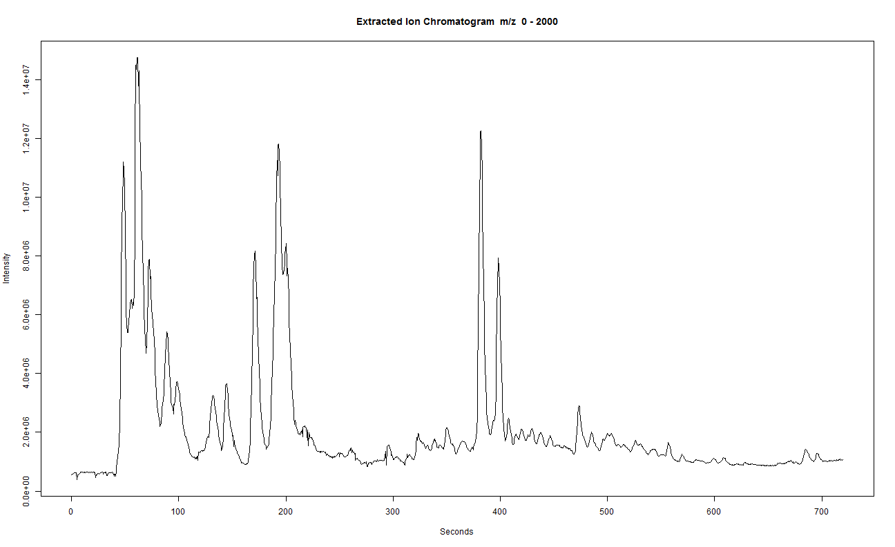
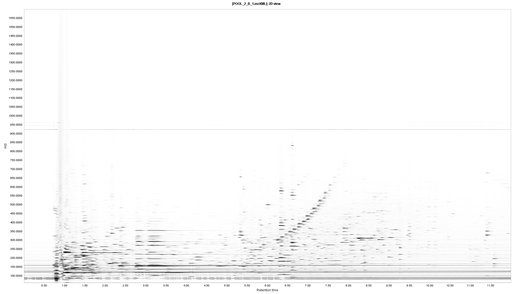
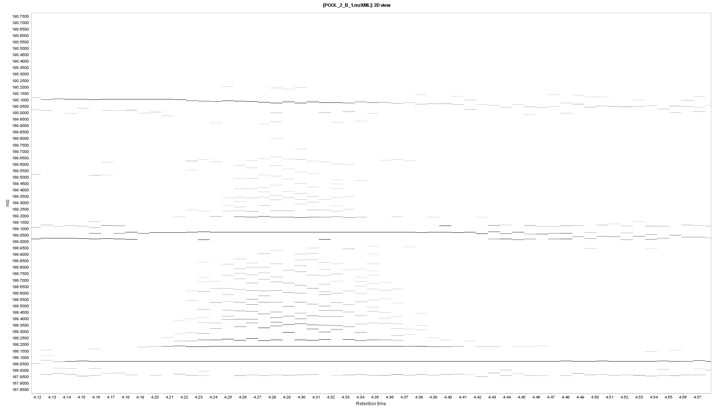

XCMS course 2017
========================================================
author: 
date: 
autosize: true
width: 2540
height: 1429


Outline (1)
========================================================

**XCMS**
- What does the data look like? Why pre-processing?
- Peak picking (xcmsSet)
- Grouping and retention time correction (group & retcor)
- Filling missing values (fillPeaks)
- Checking the results


Outline (2)
========================================================

**CAMERA**
- Creating the CAMERA object (xsAnnotate)
- Naive RT binning (groupFWHM)
- Refining of groupings (groupCorr)
- Isotope annotation (findIsotopes)
- Adduct/fragment annotation (findAdducts)


Outline (3)
========================================================
**Stats**
- The fast way
- Alternative stats


What does the data look like? Why pre-processing?
========================================================
- 3D to 2D

<br>
This is what XCMS does:
- Peak-picking
- Group peaks across samples (+retention time alignment)
- Examine raw data for peaks that were not found in all samples

<br>
Simply to do. Difficult to do well. Impossible to do perfectly.


Peak picking
========================================================

- Two algoritms
- Finding reasonable peak width
- profparam
- prefilter
- Difference LC/GC (max for matchedfilter)
- Checking the results
- Exclude blanks

Find the files
========================================================
First we locate the files.
They need to be in an open format: 
* mzML (newest)
* mzData
* mzXML (most widely supported)
* netCDF (obsolete, last resort)

<br>

Lets make a list of the files we want to pre-process.

```r
files <- list.files("_data", recursive = TRUE, full.names = TRUE, pattern=".mzXML")
head(files,5)
```

```
[1] "_data/A/POOL_1_A_1.mzXML" "_data/A/POOL_1_A_2.mzXML"
[3] "_data/A/POOL_1_A_3.mzXML" "_data/A/POOL_2_A_1.mzXML"
[5] "_data/A/POOL_2_A_2.mzXML"
```

<br>
Blanks interfer with peak alignment since there are so few peaks. So better remove them before starting. Same goes for compound mixtures.


Peak picking
========================================================

Now we can do peak picking. We need to load some packages first.


```r
suppressMessages(library(xcms)) # suppress avoids a flood of messages
suppressMessages(library(BiocParallel))
```

<br>
By dafault the newest XCMS uses all available cores.<br>
Below we are setting it to use one just because it works better for generating this presentation.

To control the number of cores you could for example do:

```r
suppressMessages(library(parallel))
BPPARAM  = SnowParam(detectCores()-2, progressbar = TRUE)
```

<br>
Now lets do the peak picking.<br>
There are many parameters to set that we will explain in a sec.<br>
There are a few more settings available but these are the most important.

```r
xset <- xcmsSet(files[c(1,2,11,12,21,22)], 
                BPPARAM  = SerialParam(),
                method = 'centWave',
                prefilter = c(3,1E3),
                ppm = 20,
                snthr = 5e3,
                profparam = list(step=0.005),
                peakwidth = c(0.05*60,0.20*60)
                )
```

```

 Detecting mass traces at 20 ppm ... 
 % finished: 0 10 20 30 40 50 60 70 80 90 100 
 20814 m/z ROI's.

 Detecting chromatographic peaks ... 
 % finished: 0 10 20 30 40 50 60 70 80 90 100 
 1001  Peaks.

 Detecting mass traces at 20 ppm ... 
 % finished: 0 10 20 30 40 50 60 70 80 90 100 
 20908 m/z ROI's.

 Detecting chromatographic peaks ... 
 % finished: 0 10 20 30 40 50 60 70 80 90 100 
 956  Peaks.

 Detecting mass traces at 20 ppm ... 
 % finished: 0 10 20 30 40 50 60 70 80 90 100 
 20312 m/z ROI's.

 Detecting chromatographic peaks ... 
 % finished: 0 10 20 30 40 50 60 70 80 90 100 
 985  Peaks.

 Detecting mass traces at 20 ppm ... 
 % finished: 0 10 20 30 40 50 60 70 80 90 100 
 20580 m/z ROI's.

 Detecting chromatographic peaks ... 
 % finished: 0 10 20 30 40 50 60 70 80 90 100 
 1045  Peaks.

 Detecting mass traces at 20 ppm ... 
 % finished: 0 10 20 30 40 50 60 70 80 90 100 
 20429 m/z ROI's.

 Detecting chromatographic peaks ... 
 % finished: 0 10 20 30 40 50 60 70 80 90 100 
 976  Peaks.

 Detecting mass traces at 20 ppm ... 
 % finished: 0 10 20 30 40 50 60 70 80 90 100 
 20017 m/z ROI's.

 Detecting chromatographic peaks ... 
 % finished: 0 10 20 30 40 50 60 70 80 90 100 
 907  Peaks.
```


Peak picking - which method?
========================================================

TODO: someone should read the original papers and write something more intelligent... <br>
TODO: can we find some comparison paper(s)?

**matchedfilter** [1]
* Original algoritm
* Developed for accurate mass instruments
* Good for low accuracy data
* Good for chromatographically noisy data (also high accuracy MS)
* Fixed width peak fitting

<br>
**centWave**  [2]
* Developed for accurate mass instruments
* Flexible width peak fitting
* prefilter should make it faster
* Usually the best if the data is "nice"


Peak picking - What peak picking does
========================================================

TODO: something about how centwave works

<div align="center">

</div>


Peak picking - Prefilter
========================================================

<br>

```r
prefilter = c(3,1E3)
```
<br>
Says to only consider regions where there are at least `3` scans with intensity above `1000`.

Check your peak widths to see how many scans per peak you are sure to have.


Peak picking - Peak width
========================================================

Centwave asks you to set the minimum and maxmimum peak widths you have in your data.<br>
You set it in seconds (always seconds in XCMS) and this is what we did before.
<br>


```r
peakwidth = c(0.05*60,0.20*60)
```

It is a vector of length 2 with the  min and max length.
<br><br>

To determine reasonable values we need to look at the raw data (you'd probably use something interactive such as MzMine (or future XCMS!)).<br>
Here is a TIC:
<br>

```r
xraw <- xcmsRaw(xset@filepaths[1])
plotEIC(xraw, mzrange=c(0, 2000), , rtrange=c(0,  12*60))
```




Peak picking - Peak width
========================================================

Lets zoom in on a peak.


```r
plotEIC(xraw, 
        mzrange=c(84.9612-0.01, 84.9612+0.01), 
        rtrange=c(0.7*60,  0.9*60), 
        type="o", cex=3, pch=19, lwd=3
        )
```


***
<br><br><br><br><br><br><br><br><br>

* So we can see that this peak has ~15 scans and is about 7 s (~0.1 min) long.
* We could do the same looking at one of the longer peaks at the end of the run.
* If the short peak we can find is about 0.1 min I'd go for 0.05 min to be on the safe side. Also multiply what you can find for the longest by 2 to be safe.


Peak picking - Peak width
========================================================

You can also use a 2D plot to try to find short and long peaks.
Here I plotted with MzMine (remember to use the continuos/profile mode toggle otherwise it looks very wrong).
<br>
<div align="center">

</div>


Peak picking - ppm
========================================================

<br>
ppm === Relative deviation in the m/z dimension

<br>
Do not trust the vendors number. Like the mileage of a car these numbers are far from true in real world scenarios.<br>
We need a range that is true also for the ends of the peaks.

<br>
What we choose before was:

```r
ppm = 20
```

<br>
A 2D plot is a reasonable way to look at this.


Peak picking - ppm
========================================================


<br>
<div align="center">

</div>


Peak picking - ppm
========================================================
<br>
<div align="center">

</div>


Peak picking - ppm
========================================================

<br>
<div align="center">

</div>


Peak picking - ppm
========================================================

<br>
<div align="center">

</div>


```r
((189.074-189.0690)/189.0690)*1e6
```

```
[1] 26.44537
```


Peak picking - profparam
========================================================

<br>
First we need to clear up the confusion about the difference between *profile mode* data and the *profile matrix*.
<br>

**Profile mode:** The data is continuous in the m/z dimension. As opposed to continuous mode data where you have discrete (sticks) in the m/z dimension.

**Profile matrix:** A rt (or scan rather) × m/z matrix of m/z slices.
XCMS uses this for some procedures instead of the full raw data. Think of it as binned data with less m/z resolution.

* The profparam parameter says how fine the binning in the *Profile matrix* is gonna be.
* For high dimensional data the default setting can cause problems. So setting something like this will set it to 0.005 Da slices.
* It cannot be set too low as slices will be combined as needed. Only memory usage will increase.

```r
profparam = list(step=0.005)
```


Peak picking - snthr
========================================================

snthr = 5e3
               
                
                
                


Peak picking
========================================================

N.B.: Waters' data and *lockMassFreq*.


Grouping and retention time correction
========================================================
- minsamp/minfrac is per group and critical
- bw
- retcor
  - span
- Debugging
  - Peak picking or alignment?
  - bw or mzwid adjustment needed?
  


Filling missing values (fillPeaks)
========================================================
- Importance of profparam previously set
- Problem of very accurate data


Checking the results
========================================================
- Are isomers separated?
- Do you find peaks you know should be there?


Creating the CAMERA object (xsAnnotate)
========================================================
- What is CAMERA?


Naive RT binning (groupFWHM)
========================================================
- perfwhm


Refining of groupings (groupCorr)
========================================================
- calcCaS
- calcCiS
- Choose wisely


Isotope annotation (findIsotopes)
========================================================


Adduct/fragment annotation (findAdducts)
========================================================
- The rules list


Bibliography
========================================================

[1] C. a. Smith, E. J. Want, G. O\&apos;Maille, R. Abagyan, et al.
"XCMS: Processing mass spectrometry data for metabolite profiling
using nonlinear peak alignment, matching, and identification". In:
_Analytical Chemistry_ 78.3 (feb. 2006), pp. 779-787. ISSN:
00032700. DOI: 10.1021/ac051437y. <URL:
http://dx.doi.org/10.1021/ac051437y
http://pubs.acs.org.ep.fjernadgang.kb.dk/doi/full/10.1021/ac051437y
http://pubs.acs.org.ep.fjernadgang.kb.dk/doi/pdfplus/10.1021/ac051437y>.

[2] R. Tautenhahn, C. Böttcher and S. Neumann. "Highly sensitive
feature detection for high resolution LC/MS.". En. In: _BMC
bioinformatics_ 9.1 (nov. 2008), p. 504. ISSN: 1471-2105. DOI:
10.1186/1471-2105-9-504. <URL:
http://www.biomedcentral.com/1471-2105/9/504/abstract
http://www.biomedcentral.com/1471-2105/9/504
http://www.biomedcentral.com/content/pdf/1471-2105-9-504.pdf>.


png(file="plots/EIC%d.png")
xset <- xcmsSet(files[c(1,2,11,12,21,22)], 
                BPPARAM  = SerialParam(),
                method = 'centWave',
                prefilter = c(3,1E3),
                ppm = 20,
                snthr = 5e3,
                profparam = list(step=0.005),
                peakwidth = c(0.05*60,0.20*60),
                sleep=0.01)
dev.off()
